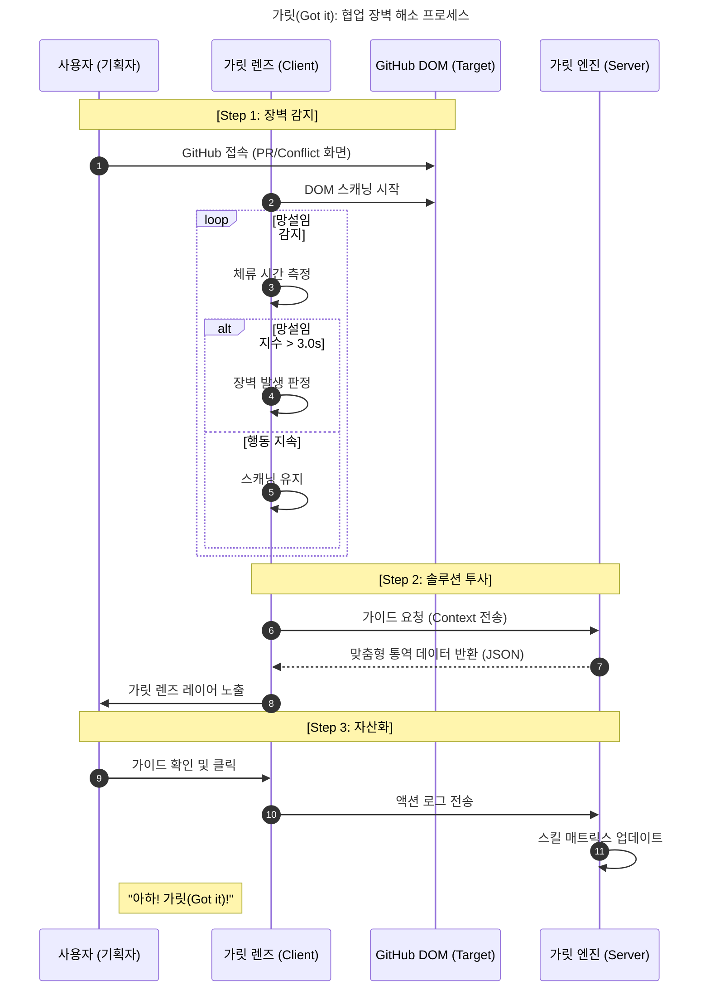

sample

```mermaid
    sequenceDiagram
        autonumber
        title 가릿(Got it): 협업 장벽 해소 프로세스

        participant U as 사용자 (기획자)
        participant E as 가릿 렌즈 (Client)
        participant D as GitHub DOM (Target)
        participant S as 가릿 엔진 (Server)

        Note over U, D: [Step 1: 장벽 감지]
        U->>D: GitHub 접속 (PR/Conflict 화면)
        E->>D: DOM 스캐닝 시작
        
        loop 망설임 감지
            E->>E: 체류 시간 측정
            alt 망설임 지수 > 3.0s
                E->>E: 장벽 발생 판정
            else 행동 지속
                E->>E: 스캐닝 유지
            end
        end

        Note over E, S: [Step 2: 솔루션 투사]
        E->>S: 가이드 요청 (Context 전송)
        S-->>E: 맞춤형 통역 데이터 반환 (JSON)
        E->>U: 가릿 렌즈 레이어 노출

        Note over U, S: [Step 3: 자산화]
        U->>E: 가이드 확인 및 클릭
        E->>S: 액션 로그 전송
        S->>S: 스킬 매트릭스 업데이트
        
        Note right of U: "아하! 가릿(Got it)!"
```